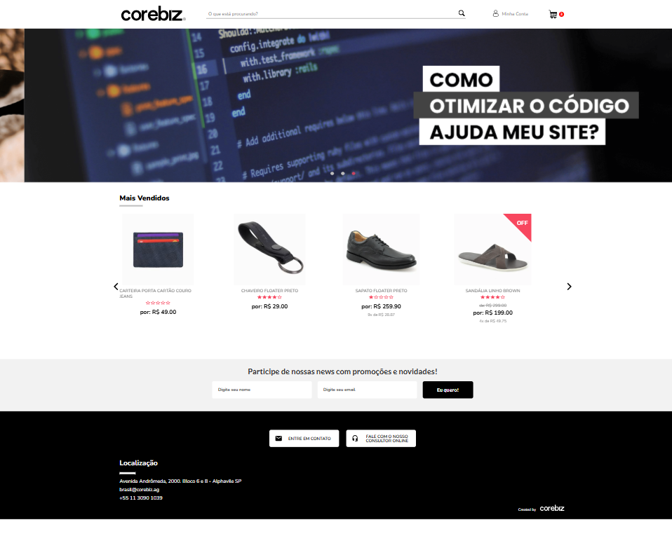

#  Teste Técnico I Full Stack Developer Junior  - Corebiz

Este repositório contém um projeto web desenvolvido como parte de um teste técnico para a vaga de Front-End Júnior na Corebiz. O objetivo do projeto foi demonstrar habilidades em tecnologias e práticas de desenvolvimento front-end, abordando aspectos como usabilidade, design responsivo, e integração com APIs. O código foi estruturado para ser de fácil manutenção, buscando se adequaar as boas práticas de desenvolvimento.

## Tecnologias Utilizadas
- **Vite JS**: Ferramenta de build rápida e eficiente.
- **React**: Biblioteca para criação de interfaces dinâmicas.
- **HTML**: Marcação semântica para estruturação de conteúdo.
- **SCSS**: Pré-processador CSS com variáveis e aninhamento, permitindo um código mais organizado.


## Execução do Projeto

Siga os passos abaixo para rodar o projeto localmente em sua máquina:

### Requisitos
- **Node.js**: Versão 16 ou superior.
- **npm**: Gerenciador de pacotes do Node.js (normalmente instalado junto com o Node.js).
- **Git**: Para clonar o repositório.

### Passos

1. Clone o repositório:
   ```bash
   git clone https://github.com/EmmanuelVitor-22/corebiz-frontend-challenge.git
   ```

2. Acesse o diretório do projeto:
 ```bash
 cd corebiz-frontend-challenge
 ```

3. Instale as dependências:
 ```bash
 npm install
 ```

4. Para iniciar o servidor de desenvolvimento:
 ```bash
 npm run dev
 ```

5. Acesse o projeto no navegador:
 ```bash
 http://localhost:5173
 ```

Agora o site estará em execução localmente, e você poderá interagir com a interface diretamente no seu navegador.

## Desktop



## Mobile


